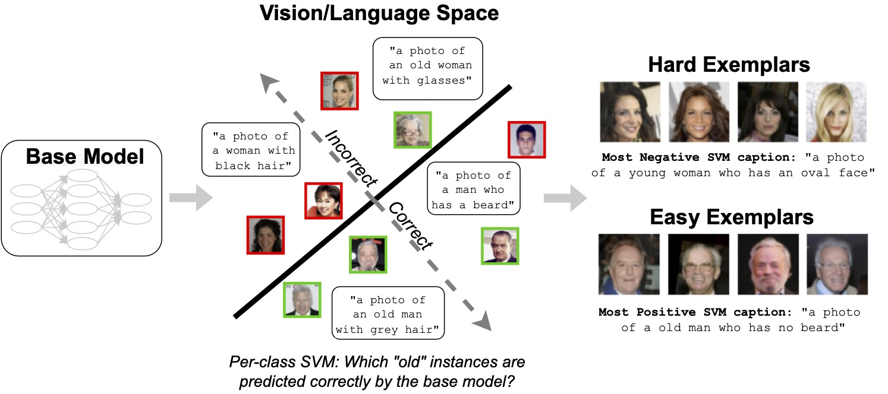

# Distilling Model Failures as Directions in Latent Space
Here we provide the code for our paper: **[Distilling Model Failures as Directions in Latent Space](https://arxiv.org/abs/2206.14754)**

<p>

</p>

## Getting Started
* **pip** package coming soon! stay tuned

Clone the repository. Make sure that you have [git LFS](https://git-lfs.github.com/) installed

**Example:** For a walkthrough of using our method [Example notebook](https://github.com/MadryLab/failure-directions/blob/release/example/Example.ipynb)! This notebook walks through using our method on CIFAR-10.

The main methods for our analysis are contained in [wrappers.py](https://github.com/MadryLab/failure-directions/blob/release/failure_directions/src/wrappers.py). Specifically:
```
SVMFitter: utility wrapper to fit the SVM
CLIPProcessor: utility wrapper for CLIP operations
```

In order to fit the SVM and extract the corresponding direction, run (assuming `hparams` contains the mean and std) for the dataset:
```
import failure_directions
# let hparams contain mean and std for dataset
# let loaders contain a dict of train, test, val loaders.
# let split_gts contain the ground truth labels for each split
# let split_preds contain the predictions for each split

# Load CLIP features
clip_processor = failure_directions.CLIPProcessor(ds_mean=hparams['mean'], ds_std=hparams['std'])
clip_features = {}
for split, loader in loaders.items():
    clip_features[split] = clip_processor.evaluate_clip_images(loader)
    
# Fit SVM
svm_fitter = failure_directions.SVMFitter()
svm_fitter.set_preprocess(clip_features['train'])
cv_scores = svm_fitter.fit(preds=split_preds['val'], ys=split_gts['val'], latents=clip_features['val'])

# Get SVM decision values
svm_predictions = {}
svm_decision_values = {}
for split, loader in loaders.items():
    mask, dv = svm_fitter.predict(ys=split_gts[split], latents=clip_features[split], compute_metrics=False)
    svm_predictions[split] = mask
    svm_decision_values[split] = dv
```


## Training models
We use FFCV (https://ffcv.io/) to train our models. Dataset betons can be created using the notebooks in `setup_nbs`.

There are two main scripts: 
```
ffcv_main.py: training a base model and performing interventions
train_svms.py: use our framework given a base file
```

`ffcv_main.py` is used to train the base model and the model after interventions. For example, for CIFAR10:

```
python ffcv_main.py -c dataset_configs/cifar.yaml --indices-file index_files/cifar_0.25_with_unlabeled.pt --exp-name cifar_model
```

Specifically, ffcv_main.py has the following arguments.  
```
ffcv_main.py
-c               A config from (c.f dataset_configs) which contains dataset and training argument information.
                 See src/config_parsing.py for all config options
--indices-file   A pt file (c.f index_files) containing a array of which indices to include for each split. 
                 The index file should have the keys val_indices, train_indices, and (optionally) unlabelled_indices.
                 See setup_nbs/make_index_files.ipynb for examples on how these index files were created. 
                 Edit for subsampling intervention
--exp-name       Experiment name
--loss-vec-file  Optionally, a pytorch file with loss weights for each example. Used for upweighting intervention
--root           The directory where the FFCV betons are stored (see setup_nb and scripts for beton generation)
```


To then run our framework on top of this model, use `train_svms.py`. For example:

```
python train_svms.py -c dataset_configs/cifar.yaml -s svm_configs/normalized_svm_base_config.yaml --indices-file index_files/cifar_0.25_with_unlabeled.pt --model-path <model path here>  --out-file cifar_svm --unlabeled
```

Specifically, `train_svms.py` has the following arguments.
```
train_svms.py
-c               The dataset config (see above)
-s               The svm config. we use svm_configs/normalized_svm_base_config.yaml for all experiments in the paper.
--indices-file   The index file (use the same index file from running ffcv_main.py)
--model-path     The path to the model checkpoint
--out-file.      Where to dump SVM results
--unlabeled      Run SVM on unlabeled data
--root           Path to betons
--spurious       Run additional statistics for a spurious dataset.
--bce            Only used for ChestXray. Logit is binary cross entropy, and threshold detection will be performed.
--bce-class      Only used for ChestXray. Which binary logit (i.e disease) to perform our framework on.
```


Other important utilities include
```
visualization_utils.py: utiities for visualizing the most extreme images surfaced by our framework
clip_utils.py: clip utilities for automatic captioning
```

## Citation
To cite this paper, please use the following BibTeX entry:
```
@inproceedings{jain2022distilling,
   title = {Distilling Model Failures as Directions in Latent Space},
   author = {Saachi Jain and Hannah Lawrence and Ankur Moitra and Aleksander Madry}, 
   booktitle = {ArXiv preprint arXiv:2206.14754},
   year = {2022}
}
```

## Maintainers
[Saachi Jain](https://twitter.com/saachi_jain_)<br>
[Hannah Lawrence](https://twitter.com/HLawrenceCS)

